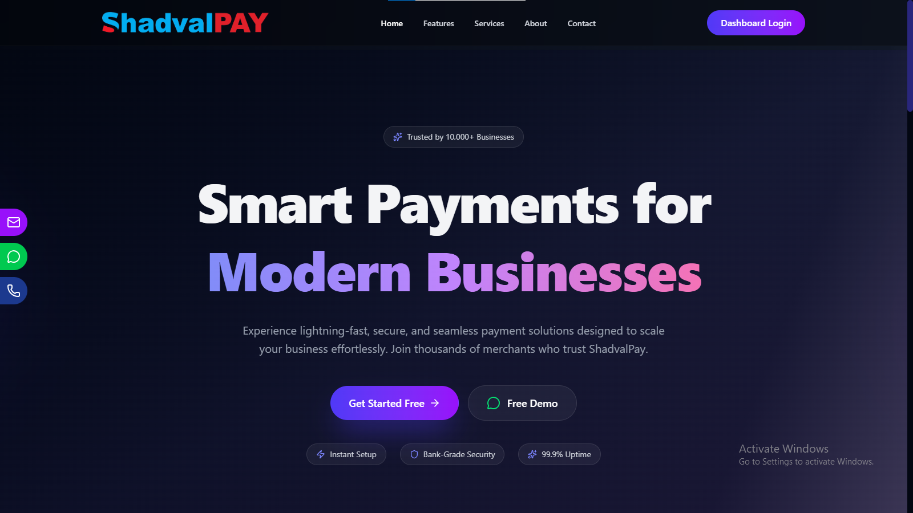
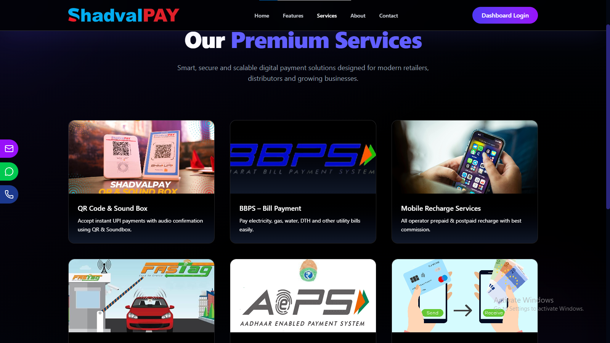
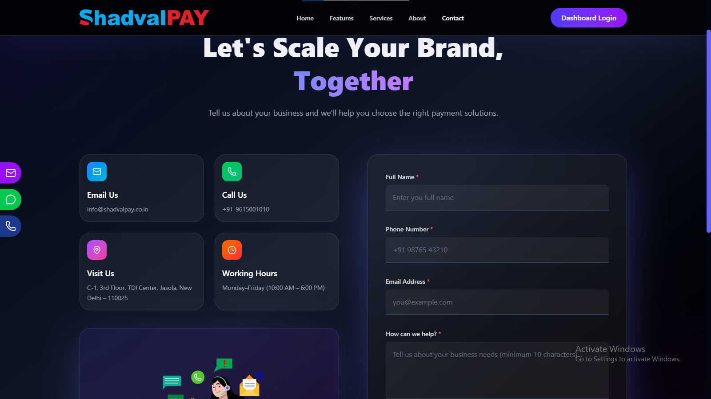

# ShadvalPay Website

A modern **React + Vite frontend website** built for the ShadvalPay fintech platform.  
The project includes a responsive UI with animations and a backend API for **form submissions using Node.js and SQL**.

---

# 🌐 Live Website
https://react.shadvalpay.co.in/

---

# 🖼️ Project Preview

## Homepage


## Services Section


## Contact Form


---

# 🛠 Tech Stack

## Frontend
- React 19
- Vite
- TailwindCSS
- Radix UI
- Framer Motion
- React Router
- Lucide Icons
- Lottie Animations

## Backend
- Node.js
- Express.js
- SQL Database
- Form Submission API

```

# 📂 Folder Structure

SHADVALPAY
│
├── client
│ ├── .vscode
│ ├── node_modules
│ ├── public
│ ├── src
│ ├── .env
│ ├── .gitignore
│ ├── eslint.config.js
│ ├── index.html
│ ├── package.json
│ ├── package-lock.json
│ └── vite.config.js
│
├── server
│ ├── node_modules
│ ├── public
│ ├── .env
│ ├── package.json
│ ├── package-lock.json
│ └── server.js
│
└── README.md

```

# ⚙️ Installation

### 1️⃣ Clone Repository

```bash
git clone https://github.com/Im-Rahul-Panchal/ShadvalPay

# Frontend
cd shadvalpay
cd client
npm install

# Backend
cd shadvalpay
cd server
npm install
